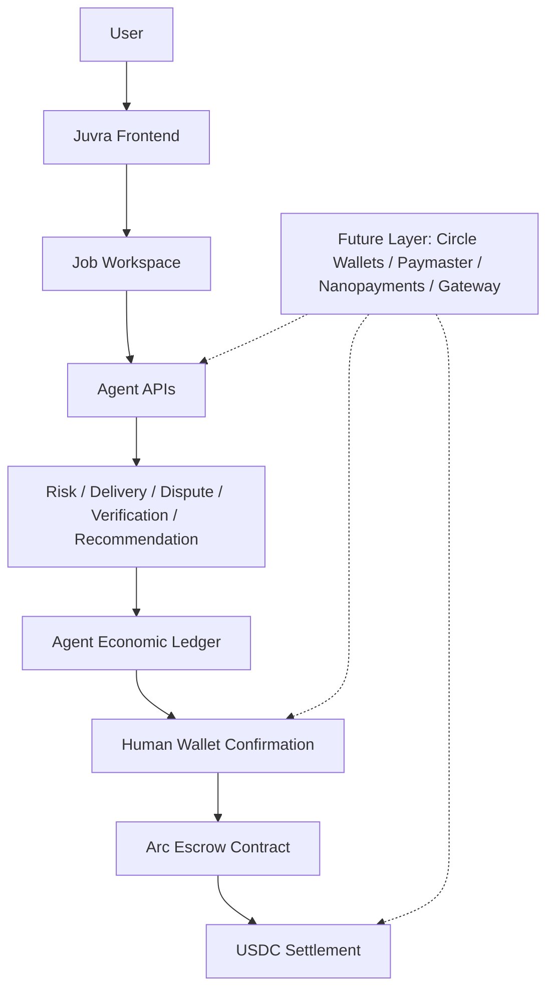

# Juvra Architecture

Juvra separates human intent from agent execution. Agents analyze scope, evidence, disputes, and verification signals, and autonomously execute escrow settlement — but only along a verdict the client recorded on-chain. Recording a verdict (approve/reject) is a human wallet confirmation that moves no funds; the contract then only lets the agent settle in that direction: release to the freelancer on approve, refund to the client on reject.

## System Diagram

## Live Components

- Next.js frontend routes: landing, jobs, job workspace, dashboard, post job, admin, dispute console
- Arc escrow smart contract integration
- USDC-denominated job and settlement UX
- Agent APIs:
  - `/api/agent/analyze-job`
  - `/api/agent/review-delivery`
  - `/api/agent/dispute-summary`
  - `/api/agent/recommend-action`
  - `/api/agent/verify-evidence`
- Local evidence persistence
- Local agent result persistence
- Local agent economic action ledger
- Gemini/mock provider abstraction with fallback

## Verification Flow

1. Evidence is attached to a job workspace.
2. The UI estimates a USDC verification cost from job status, risk flags, and evidence count.
3. `/api/agent/verify-evidence` returns a verification receipt.
4. The receipt is stored in the local agent economic action ledger.
5. The recommendation engine may use the verification result as context.
6. A human records the approve/reject verdict; the agent executes the resulting settlement on-chain.

## Circle Product Positioning

Live / implemented:

- Arc smart contract escrow
- USDC-denominated escrow logic
- Agentic risk/recommendation backend
- Verdict-gated autonomous agent settlement (recordVerdict -> agentSettle), with manual wallet-confirmed fallbacks

Future-ready / planned:

- Circle Wallets for secure agent-prepared transaction flows
- Paymaster for gas/user onboarding improvements
- Nanopayments for pay-per-verification and agent-to-service commerce
- Gateway for treasury/routing workflows
- CCTP for cross-chain USDC settlement expansion

## Safety Boundary

The agent is allowed to analyze, verify, record receipts, recommend, and execute verdict-gated settlement. The contract's agentSettle() only moves escrow along the direction of the client's recorded verdict, so the agent decides when settlement happens, never where funds go. The agent is not allowed to sign user wallet transactions, select freelancers, or resolve disputes.
