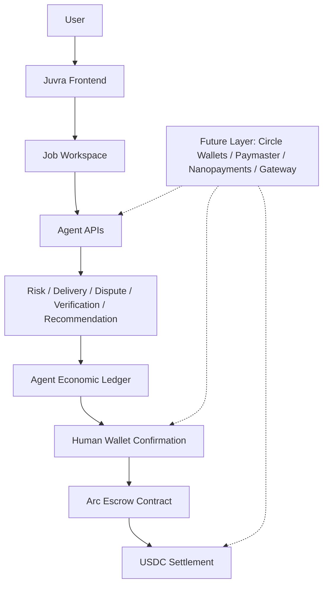

# Juvra Architecture

Juvra separates agentic decision support from escrow authority. Agents can analyze scope, evidence, disputes, and verification signals. Escrow funds move only through explicit human wallet confirmation.

## System Diagram

## Live Components

- Next.js frontend routes: landing, jobs, job workspace, dashboard, post job, admin, dispute console
- Arc escrow smart contract integration
- USDC-denominated job and settlement UX
- Agent APIs:
  - `/api/agent/analyze-job`
  - `/api/agent/review-delivery`
  - `/api/agent/dispute-summary`
  - `/api/agent/recommend-action`
  - `/api/agent/verify-evidence`
- Local evidence persistence
- Local agent result persistence
- Local agent economic action ledger
- Gemini/mock provider abstraction with fallback

## Verification Flow

1. Evidence is attached to a job workspace.
2. The UI estimates a USDC verification cost from job status, risk flags, and evidence count.
3. `/api/agent/verify-evidence` returns a verification receipt.
4. The receipt is stored in the local agent economic action ledger.
5. The recommendation engine may use the verification result as context.
6. A human still chooses and confirms any escrow write action.

## Circle Product Positioning

Live / implemented:

- Arc smart contract escrow
- USDC-denominated escrow logic
- Agentic risk/recommendation backend
- Manual wallet-confirmed settlement actions

Future-ready / planned:

- Circle Wallets for secure agent-prepared transaction flows
- Paymaster for gas/user onboarding improvements
- Nanopayments for pay-per-verification and agent-to-service commerce
- Gateway for treasury/routing workflows
- CCTP for cross-chain USDC settlement expansion

## Safety Boundary

The agent is allowed to analyze, verify, record receipts, and recommend. The agent is not allowed to release escrow, refund escrow, sign wallet transactions, select freelancers, or resolve disputes.
